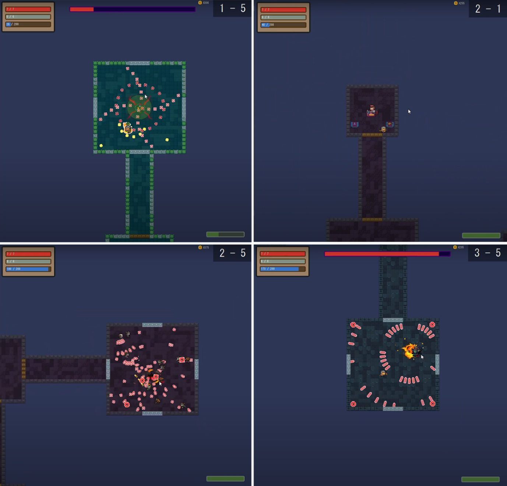

# 元氣騎士

- [Demo Video](https://www.youtube.com/watch?v=uLHkTPGW0ko)
- [English README](./readme_en.md)

## 注意事項（遊玩前請務必閱讀）
有些電腦在顯示半透明物體可能會導致卡頓現象（目前 40 系列顯卡似乎都會出現此問題）。因此如果在受傷時顯示紅色傷害效果會使遊戲完全卡住，請前往 `config.h`，將最後一項 `TRANSLUCENT_EFFECT` 改為 `false`。這樣會將毒圈變為實心的綠色圓圈，可能會遮擋視線。

## 遊戲控制
- "W", "A", "S", "D"：移動。
- "Q"：啟動角色技能。螢幕右下角會顯示技能冷卻進度條，技能冷卻完成後方可再次使用。
- "E"：切換武器（僅在持有兩把武器時有效）。
- "F"：與互動項目互動，例如進入傳送門、購買物品、拾取武器或藥水、開啟寶箱等。靠近互動項目時會顯示提示。
- "移動滑鼠"：瞄準敵人。
- "滑鼠左鍵"：使用武器攻擊。

## 作弊模式
如果想讓遊戲更簡單，可以把 `Knight.cpp` 的第 26 行將 `Knight` 的武器從 `BadPistol` 更改為 `GatlingGun`。

**數字鍵的功能**
1. 顯示 / 隱藏碰撞箱
2. 恢復 100 點 MP
3. 恢復 1 點 HP
4. 獲得 100 枚金幣
5. 無敵模式
6. 穿牆模式（請勿無視怪物並使用穿牆功能在房間開始後直接進入下一層的傳送門）
7. 場上所有怪物受到 50 點傷害，並清除所有子彈
8. 獲得武器箱（可開啟隨機獲得一把武器）